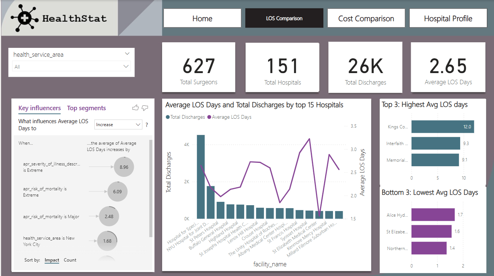
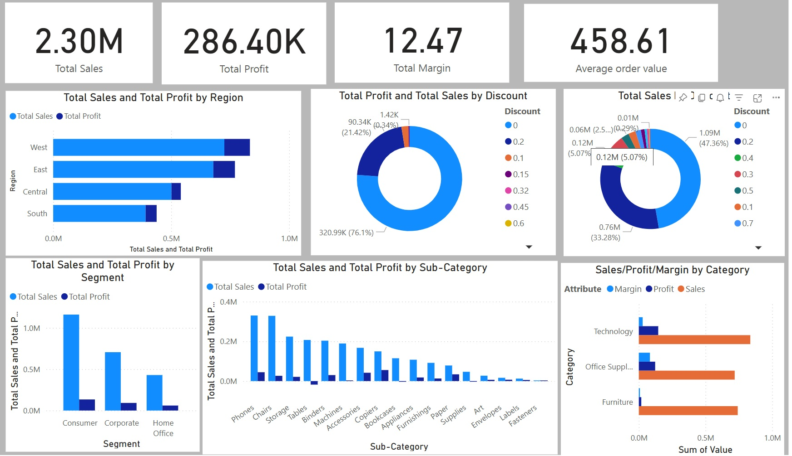

## My Data Analytics Portfolio

---

### My Projects

[Text Data Analysis By Python(Youtube Case Study)](https://www.linkedin.com/pulse/text-data-analysis-python-youtube-case-study-azadeh-irani)

 
I’m excited to announce that I recently completed a data analysis project on YouTube comments and video specs using Python! The project involved collecting data from YouTube, cleaning and preprocessing it, and conducting sentiment and emoji analysis. The analysis yielded insights into frequently used words and emojis in user comments. Additionally, the project examined YouTube video details to identify trends and correlations between specific parameters such as likes, comments, views, video category, and the impact of punctuation on views. The findings indicated that the Music category receives the most likes, and negative words like “worst” and “terrible” are common in user comments. The project concludes by highlighting limitations and areas for further investigation. I hope this helps! Let me know if you have any other questions. I would like to express my gratitude to @Nariman Jafarieshlaghi for being an amazing colleague with whom I had the pleasure of working on a joint project. His contributions and insights were invaluable to the success of the project.
 
---
---
## Turning Data into Meaningful Insights in Power BI

[Healthcare Analytics Dashboard](https://app.powerbi.com/groups/me/reports/da4d9a28-2e9b-4f5d-a640-60e458937c56/dceaf307347caa306738?experience=power-bi)

⚕️ **Hospital Performance Uncovered:**  
I connected to an anonymized hospital discharge dataset, cleaned and shaped it in Power BI, then modeled it for easy exploration.

💡 **Metrics & Benchmarks:**  
Using DAX, I created measures for **Average LOS**, **Average Cost per Discharge**, and **benchmark comparisons** to highlight how each hospital stacks up.

✨ **Interactive Visuals:**  
I added **conditional formatting** to call out outliers and used **scatter plots** with reference lines to visually pinpoint efficiency gaps.

♻️ **Root Cause Focus:**  
With filters and slicers, users can see how **patient severity**, **mortality risk**, or **location** might drive longer stays or higher costs.

The result? **A clear, dynamic dashboard** that makes it fun to spot trends, ask deeper questions, and **spark real improvements** in patient outcomes. It’s not just numbers anymore—it’s **healthcare analytics** made easy!

[**View My Healthcare Analytics Dashboard**](https://app.powerbi.com/groups/me/reports/da4d9a28-2e9b-4f5d-a640-60e458937c56/dceaf307347caa306738?experience=power-bi)

---

[📊 Superstore Sales and Profit Analysis](https://app.powerbi.com/groups/me/reports/521d833a-9ffd-42fc-bf8b-f6b0d161e18b/7f99c92198bc34105cb1?experience=power-bi)  
  
 
In this Power BI project, I analyzed the Superstore dataset to visualize key metrics like **Total Sales**, **Profit**, and **Discount Effectiveness**. The dashboard provides insights by **region**, **segment**, and **product categories**, helping uncover opportunities to improve business performance.

**Key Visualizations:**
- 📍 Sales and Profit by Region (stacked bar chart)
- 👥 Sales and Profit by Segment (bar chart)
- 📦 Sales and Profit by Sub-Category (breakdown chart)
- 💸 Discount Effectiveness (pie chart)
- 📊 Average Order Value (KPI indicator)

**Tools Used:** Power BI, Superstore Dataset  
This project strengthened my data visualization skills and helped deliver actionable insights for business decision-making.

 

---

[📦 Inventory Analysis with Power BI](https://app.powerbi.com/groups/me/reports/4771c90f-c6b0-47d8-b936-5f4c90aa8d68/2a8b0ad73778eae609d9?experience=power-bi)  
  
 
This Power BI dashboard was built to analyze inventory performance in the ready-to-eat department of a grocery store. The goal was to improve profitability and reduce losses from unsold products.

**Highlights:**
- Calculated **inventory turnover** to measure efficiency
- Built visualizations for **COGS**, **profit**, and **sales by country**
- Created a clean one-page dashboard for business decisions
- Recommended changes to ordering strategy based on data insights

 

---

### Projects Listed

- [Text Data Analysis By Python(Youtube Case Study)](https://www.linkedin.com/pulse/text-data-analysis-python-youtube-case-study-azadeh-irani)
---
<!--[Project 2 Title](/pdf/sample_presentation.pdf)

-->
---
<!--[Project 3 Title](http://example.com/)

-->
---

<!-- - [Project 1 Title](http://example.com/) -->
<!-- - [Project 2 Title](http://example.com/) -->
<!-- - [Project 3 Title](http://example.com/) -->
<!-- - [Project 4 Title](http://example.com/) -->
<!-- - [Project 5 Title](http://example.com/) -->
